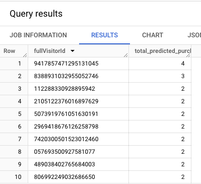

= Predict Visitor Purchases with BigQuery ML 
:toc: manual

== About BigQuery ML

* BigQuery Machine Learning (BigQuery ML) enables users to create and execute machine learning models in BigQuery using SQL queries.
* The goal of BigQuery ML is to democratise machine learning by enabling SQL practitioners to build models using their existing tools and to increase development speed by eliminating the need for data movement.

== Data

=== Create a dataset

* Create a new dataset within your project by clicking the three dots next to your project ID in the Explorer section, then clicking on Create dataset.

* The Create dataset dialog opens, Enter `bqml_lab` for Dataset ID, and click on CREATE DATASET (accepting the other default values).

=== Explore the data

[cols="5a,5a"]
|===
|Trainning dataset |Inference dataset

|
* Google Analytics records for the Google Merchandise Store,
* Extract 10000 rows for Model Training

| 

* Only Extract July data

|
[source,sql]
----
SELECT
  IF(totals.transactions IS NULL, 0, 1) AS label,
  IFNULL(device.operatingSystem, "") AS os,
  device.isMobile AS is_mobile,
  IFNULL(geoNetwork.country, "") AS country,
  IFNULL(totals.pageviews, 0) AS pageviews
FROM
  `bigquery-public-data.google_analytics_sample.ga_sessions_*`
WHERE
  _TABLE_SUFFIX BETWEEN '20160801' AND '20170631'
LIMIT 10000;
----

|
[source,sql]
----
SELECT
  IF(totals.transactions IS NULL, 0, 1) AS label,
  IFNULL(device.operatingSystem, "") AS os,
  device.isMobile AS is_mobile,
  IFNULL(geoNetwork.country, "") AS country,
  IFNULL(totals.pageviews, 0) AS pageviews
FROM
  `bigquery-public-data.google_analytics_sample.ga_sessions_*`
WHERE
  _TABLE_SUFFIX BETWEEN '20160801' AND '20170631'
LIMIT 10000;
----

|`training_data`
|`july-data` 

|
|

|===

== BigQuery ML Model

[cols="2,5a"]
|===
|ITEM |EXAMPLE

|CREATE MODEL
|
[source,sql]
----
CREATE OR REPLACE MODEL `bqml_lab.sample_model`
OPTIONS(model_type='logistic_reg') AS
SELECT * from `bqml_lab.training_data`;
----

|ml.EVALUATE
|
[source,sql]
----
SELECT
  *
FROM
  ml.EVALUATE(MODEL `bqml_lab.sample_model`);
----

|ml.PREDICT
|
[source,sql]
----
SELECT
  country,
  SUM(predicted_label) as total_predicted_purchases
FROM
  ml.PREDICT(MODEL `bqml_lab.sample_model`, (
SELECT * FROM `bqml_lab.july_data`))
GROUP BY country
ORDER BY total_predicted_purchases DESC
LIMIT 10;
----
|===

=== Create a model

[source,sql]
----
CREATE OR REPLACE MODEL `bqml_lab.sample_model`
OPTIONS(model_type='logistic_reg') AS
SELECT * from `bqml_lab.training_data`;
---- 

=== Evaluate the Model

[source,sql]
----
SELECT
  *
FROM
  ml.EVALUATE(MODEL `bqml_lab.sample_model`);
----

=== Use the model

[cols="5a,5a"]
|===
|Predict purchases per country/region |Predict purchases per user

|
[source,sql]
----
SELECT
  country,
  SUM(predicted_label) as total_predicted_purchases
FROM
  ml.PREDICT(MODEL `bqml_lab.sample_model`, (SELECT * FROM `bqml_lab.july_data`))
GROUP BY country
ORDER BY total_predicted_purchases DESC
LIMIT 10;
----
|
[source,sql]
----
SELECT
  fullVisitorId,
  SUM(predicted_label) as total_predicted_purchases
FROM
  ml.PREDICT(MODEL `bqml_lab.sample_model`, (SELECT * FROM `bqml_lab.july_data`))
GROUP BY fullVisitorId
ORDER BY total_predicted_purchases DESC
LIMIT 10;
----

|
|

|===
