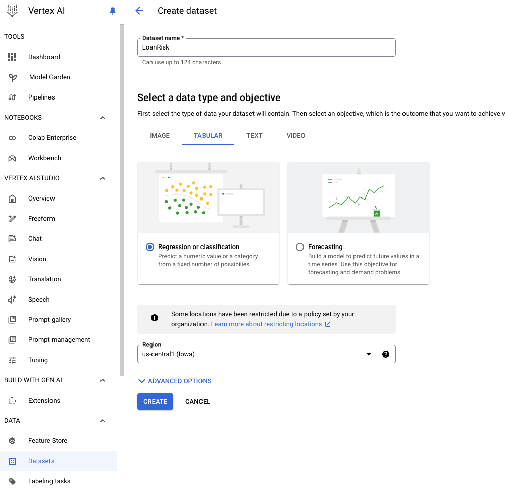
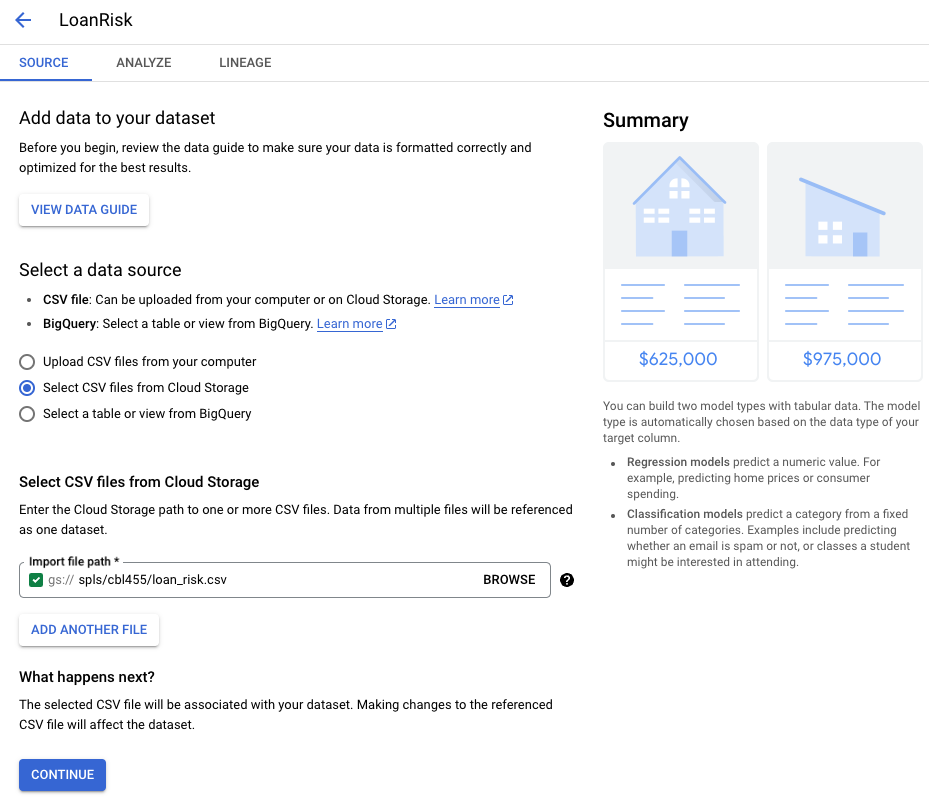
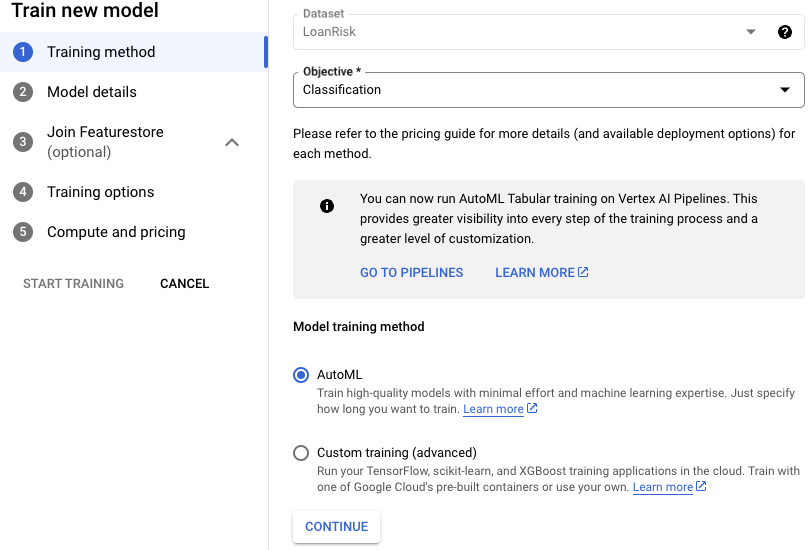
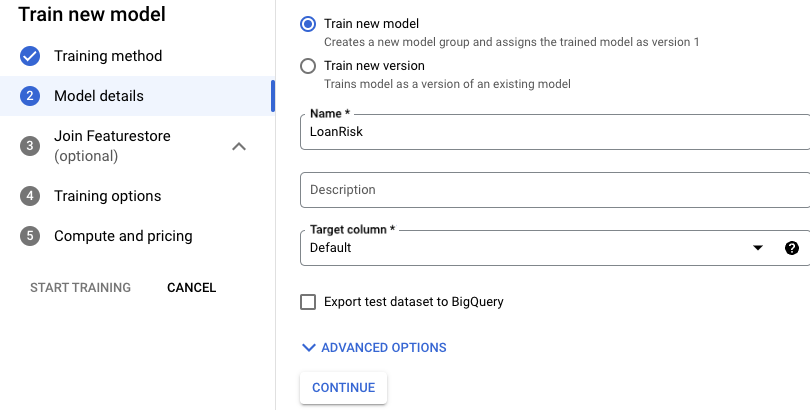
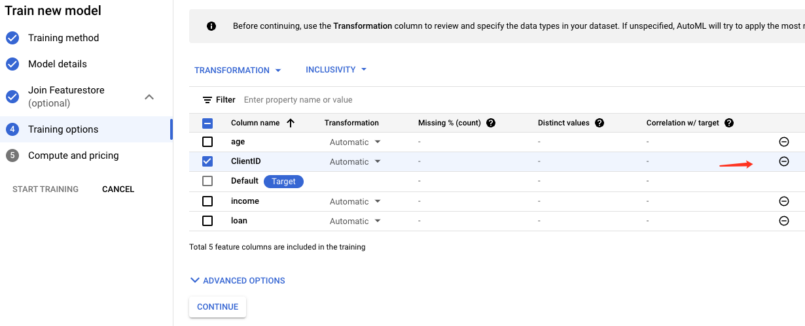
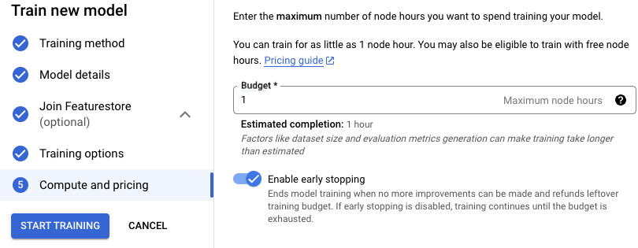
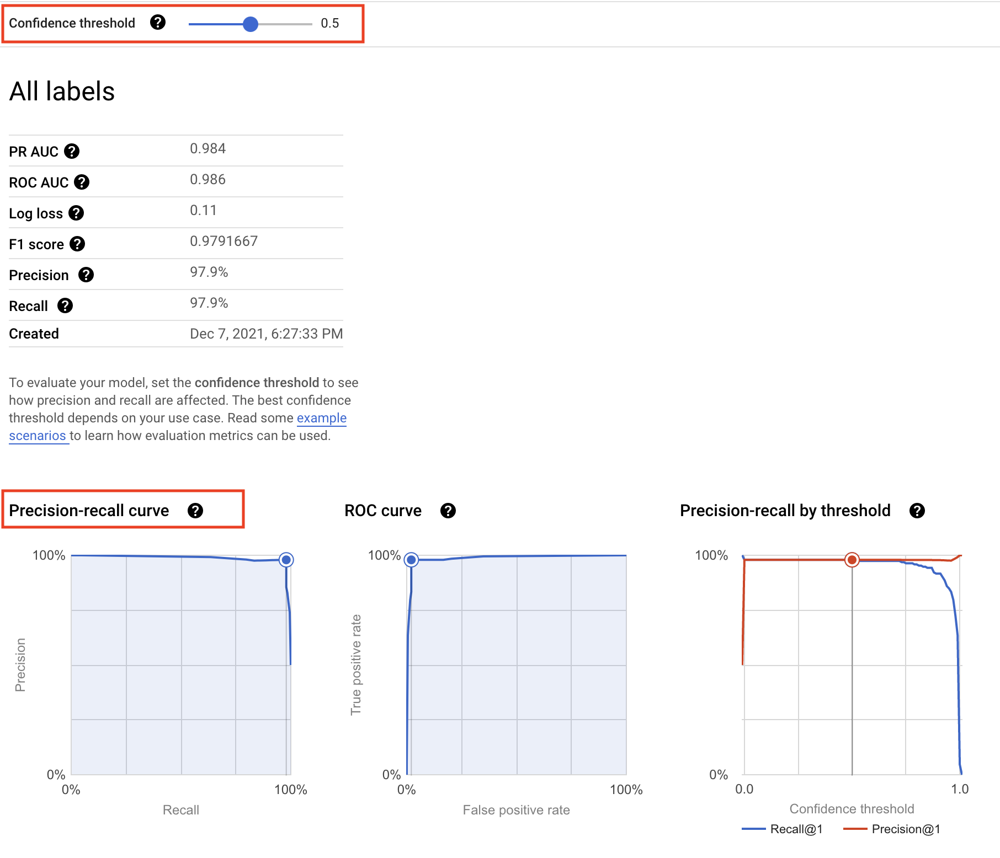
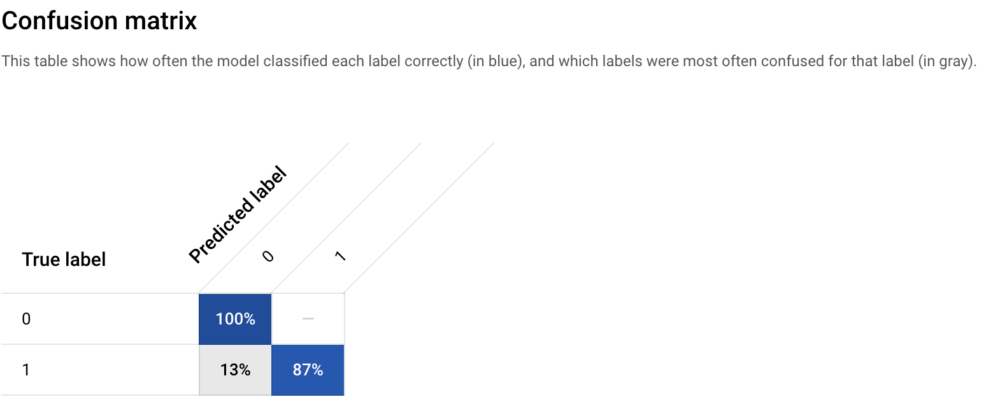
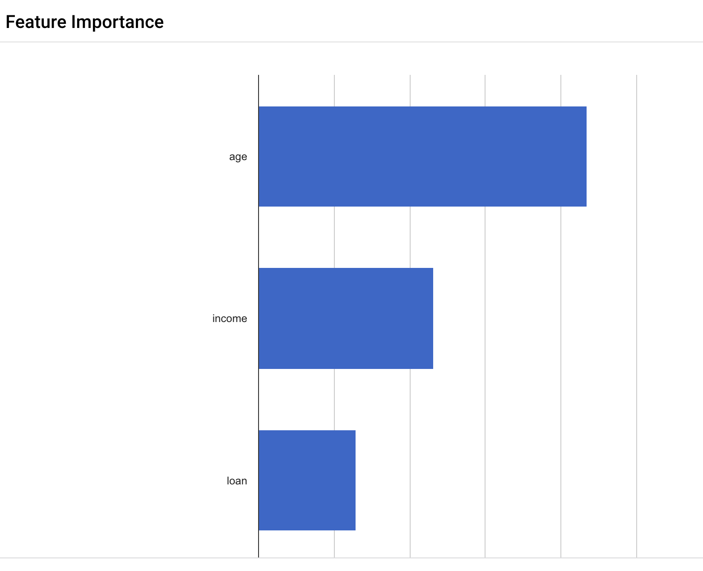

= Predicting Loan Risk with AutoML 
:toc: manual

== About Vertex AI

Vertex AI, the unified AI platform on Google Cloud to train and deploy a ML model. Vertex AI offers two options on one platform to build a ML model: 

* a codeless solution with *AutoML*
* a code-based solution with *Custom Training* using Vertex Workbench

In this section will use *AutoML* to build a ML model to determine whether a particular customer will repay a loan.

== Data Preparation

=== Create a dataset

1. In the Google Cloud console, on the *Navigation menu*, click *Vertex AI > Datasets*.
2. Click *Create dataset*.
3. Give dataset a name `LoanRisk`.
4. For the data type and objective, click *Tabular*, and then select *Regression/classification*.
5. Click *Create*.

 
=== Upload data

There are three options to import data in Vertex AI:

* Upload CSV files from your computer.
* Select CSV files from Cloud Storage.
* Select a table or view from BigQuery.

1. For the data source, select *Select CSV files from Cloud Storage*.
2. For *Import file path*, enter: `spls/cbl455/loan_risk.csv`
3. Click *Continue*.

4. Click *Generate statistics* link and review the dataset.

== Model Development

=== Training method

1. Click *Train new model* button in the right top, and select *Other*.
2. The dataset is already named *LoanRisk*.
3. For *Objective*, select *Classification*.
4. Click *Continue*.

=== Model details

1. Give the model a name, such as *LoanRisk*.
2. For *Target column*, select *Default*.
3. (Optional) Explore *Advanced options* to determine how to assign the training vs. testing data and specify the encryption.
3. Click Continue.
4. For Add features, click Continue.

=== Training options

1. Click the minus sign on the *ClientID* row to exclude it from the training model.
2. Click *Continue*.

=== Start Training

1. For *Budget*, which represents the number of node hours for training, enter *1*.
2. Click *Start training*.

== Model Evaluate

1. Navigate to the *Model Registry*.
2. Click on the model you just trained.
3. Browse the *Evaluate* tab.

=== precision/recall curve

* The confidence threshold determines how a ML model counts the positive cases. 
* A higher threshold increases the precision, but decreases recall. 
* A lower threshold decreases the precision, but increases recall.

=== confusion matrix

A confusion matrix tells you the percentage of examples from each class in your test set that your model predicted correctly.

The confusion matrix shows that your initial model is able to predict 100% of the repay examples and 87% of the default examples in your test set correctly, which is not too bad.

=== feature importance

In Vertex AI, feature importance is displayed through a bar chart to illustrate how each feature contributes to a prediction. The longer the bar, or the larger the numerical value associated with a feature, the more important it is.

These feature importance values could be used to help you improve your model and have more confidence in its predictions. You might decide to remove the least important features next time you train a model or to combine two of the more significant features into a feature cross to see if this improves model performance.

