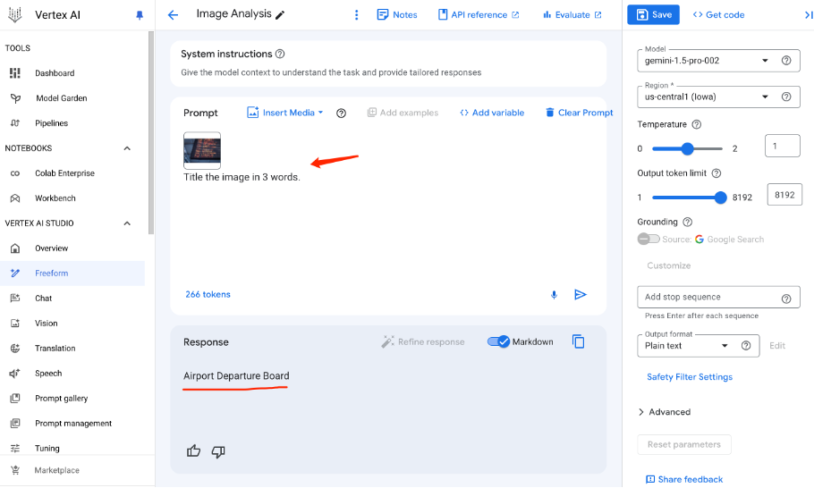
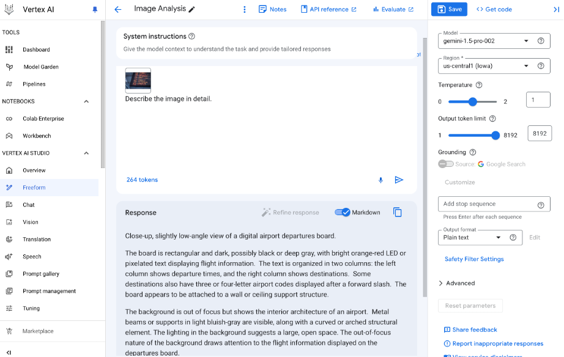
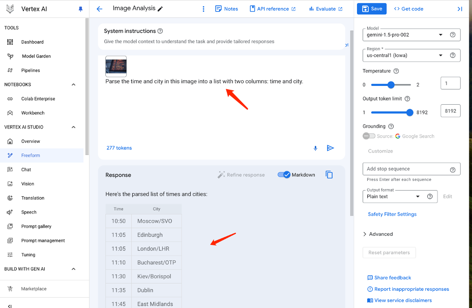
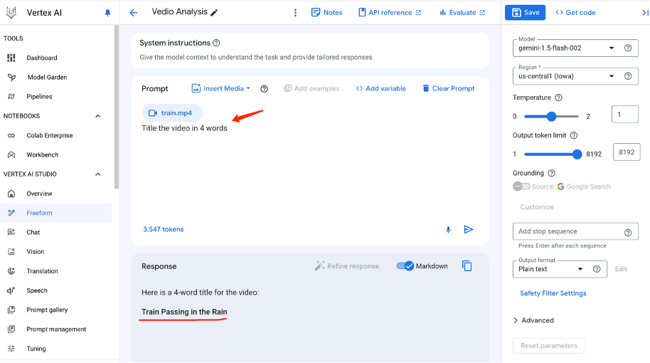
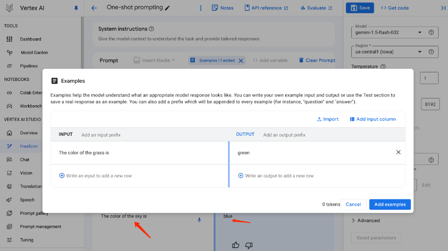
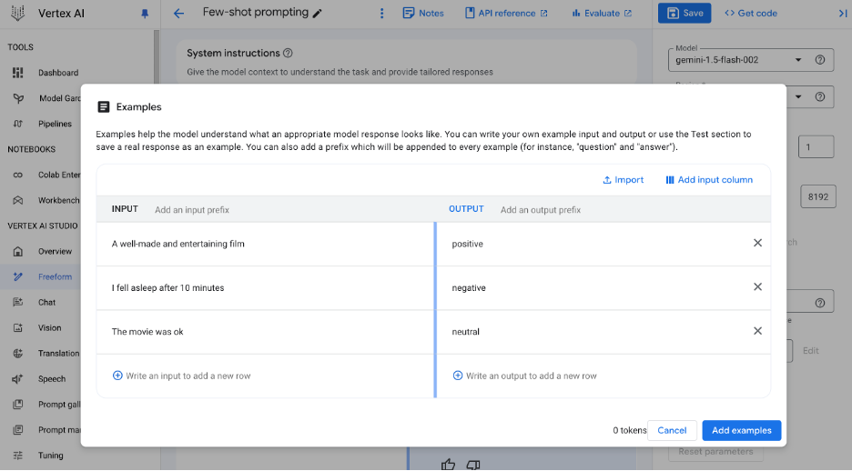

= Get Started with Vertex AI Studio 
:toc: manual

== Analyze images with Gemini in Freeform mode

=== Source Image

image:gemini-image-analysis.png[Image,500,340]

=== Image Analysis

[cols="5a"]
|===
|Title the image

|

|===

[cols="5a"]
|===
|Describe the image

|

|===

[cols="5a"]
|===
|Read the text in image

|

|===

== Vedio Analysis

[cols="5a"]
|===
|Title the vedio

|

|===

== Text Analysis

[cols="5a"]
|===
|Zero-shot prompting 

|

|===

[cols="5a"]
|===
|One-shot prompting  

|

|===

[cols="5a"]
|===
|Few-shot prompting 

|

|===
