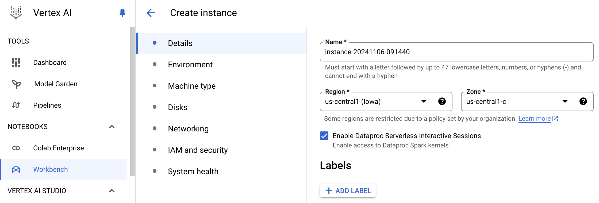
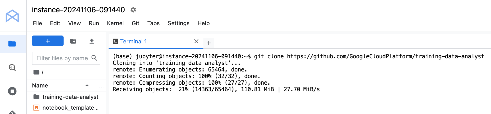
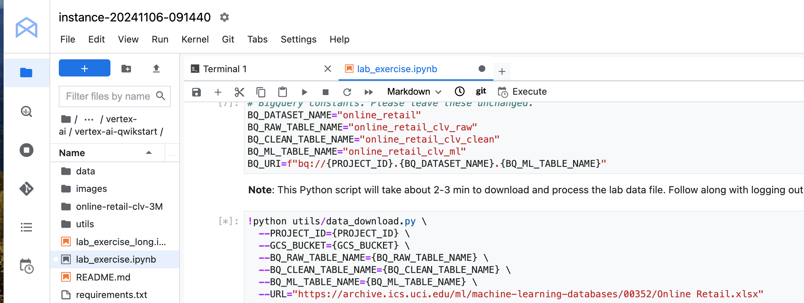

= Vertex AI Workbench 
:toc: manual

== Enable Services

[source, bash]
----
gcloud services enable \
  compute.googleapis.com \
  iam.googleapis.com \
  iamcredentials.googleapis.com \
  monitoring.googleapis.com \
  logging.googleapis.com \
  notebooks.googleapis.com \
  aiplatform.googleapis.com \
  bigquery.googleapis.com \
  artifactregistry.googleapis.com \
  cloudbuild.googleapis.com \
  container.googleapis.com
----

== Create Workbench

NOTE: Workbench Instances have JupyterLab 3 pre-installed and are configured with GPU-enabled machine learning frameworks. 

Vertex AI provides two notebook environment solutions:

* *Colab Enterprise* - A collaborative, managed notebook environment with the security and compliance capabilities of Google Cloud. 
* *Vertex AI Workbench* - A Jupyter notebook-based environment provided through virtual machine (VM) instances with features that support the entire data science workflow.

== Clone Repository

== Run Notebook

