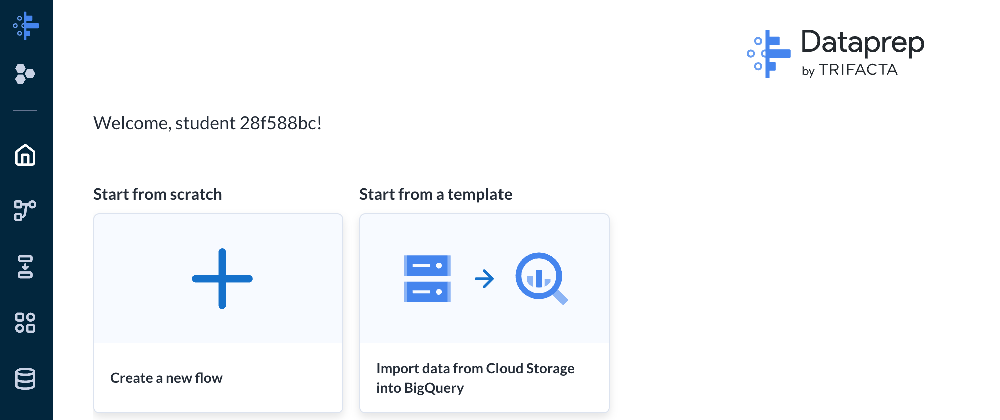

= Dataprep 
:toc: manual

== About Dataprep

* Cloud Dataprep is serverless and works at any scale. There is no infrastructure to deploy or manage. Easy data preparation with clicks and no code.
* Cloud Dataprep by Trifacta is an intelligent data service for visually exploring, cleaning, and preparing data for analysis.

== Create Dataprep

[source,bash]
----
gcloud beta services identity create --service=dataprep.googleapis.com 
----

