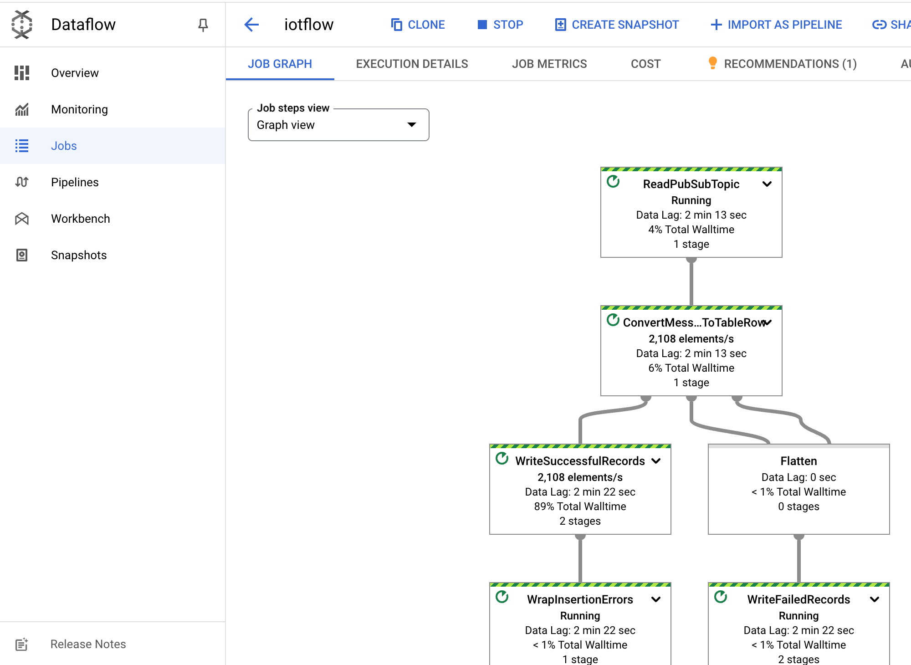

= Dataflow Templates 
:toc: manual

== About Dataflow Templates

Dataflow Templates provaide templates for processing data continuously:

* Apache Kafka to Apache Kafka
* Apache Kafka to BigQuery
* Apache Kafka to Cloud Storage
* Change Data Capture from MySQL to BigQuery (Stream)
* Bigtable change streams to BigQuery
* Bigtable change streams to Pub/Sub
* Spanner change streams to BigQuery
* Spanner change streams to Cloud Storage
* Spanner change streams to any source database
* Spanner change streams to Pub/Sub
* Datastream to BigQuery (Stream)
* Datastream to Spanner
* Datastream to MySQL or PostgreSQL (Stream)
* Data Masking/Tokenization from Cloud Storage to BigQuery (using Cloud DLP)
* JMS to Pub/Sub
* MongoDB to BigQuery (Stream)
* MQTT to Pub/Sub
* Pub/Sub to BigQuery
* Pub/Sub to BigQuery with Python UDF
* Pub/Sub Avro to BigQuery
* Pub/Sub Proto to BigQuery
* Pub/Sub Proto to BigQuery with Python UDF
* Pub/Sub Subscription to BigQuery
* Pub/Sub to Avro Files on Cloud Storage
* Pub/Sub to Datadog
* Pub/Sub to Elasticsearch
* Pub/Sub to Java Database Connectivity (JDBC)
* Pub/Sub to MongoDB
* Pub/Sub to MongoDB with Python UDF
* Pub/Sub to Pub/Sub
* Pub/Sub to Redis
* Pub/Sub to Splunk
* Pub/Sub Topic or Subscription to Text Files on Cloud Storage
* Pub/Sub Topic to Text Files on Cloud Storage
* Text Files on Cloud Storage to BigQuery (Stream)
* Cloud Storage text files to BigQuery with Python UDF
* Text files on Cloud Storage to Pub/Sub (Stream)

== Prepare Data Sources

=== BigQuery

[source, bash]
.*1. Create dataset*
----
bq mk taxirides
----

[source, bash]
.*2. Instantiate Table*
----
bq mk \
--time_partitioning_field timestamp \
--schema ride_id:string,point_idx:integer,latitude:float,longitude:float,\
timestamp:timestamp,meter_reading:float,meter_increment:float,ride_status:string,\
passenger_count:integer -t taxirides.realtime
----

=== Cloud Storage

[source, bash]
.*Create Cloud Storage bucket*
----
gsutil mb gs://$BUCKET_NAME/
----

== Run Pipleline

[source, bash]
----
gcloud dataflow jobs run iotflow \
    --gcs-location gs://dataflow-templates-us-east1/latest/PubSub_to_BigQuery \
    --region us-east1 \
    --worker-machine-type e2-medium \
    --staging-location gs://qwiklabs-gcp-03-d15afe47361a/temp \
    --parameters inputTopic=projects/pubsub-public-data/topics/taxirides-realtime,outputTableSpec=qwiklabs-gcp-03-d15afe47361a:taxirides.realtime
----

The above pipeline use `Pub/Sub to BigQuery` template, which reads messages written in JSON from a Pub/Sub topic and pushes them to a BigQuery table.

