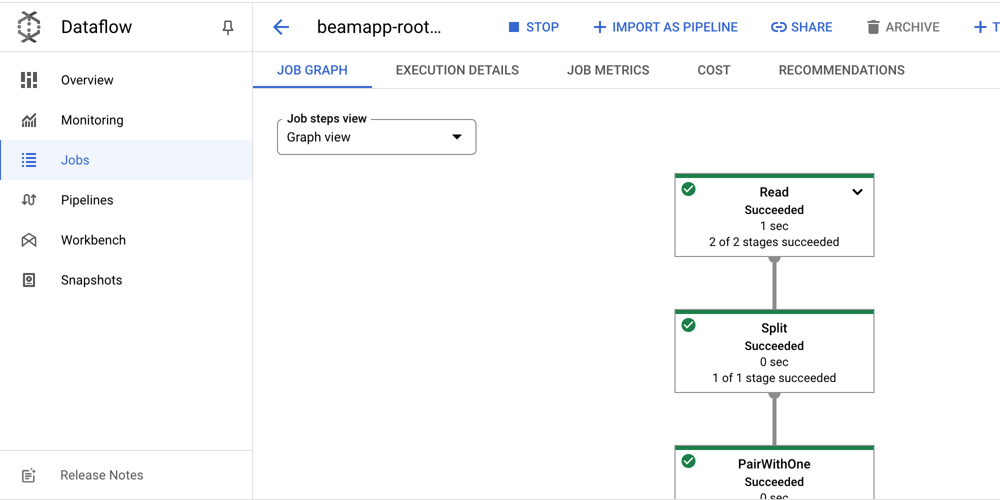

= Dataflow Python 
:toc: manual

== About Dataflow Python

The Apache Beam SDK is an open source programming model for data pipelines.

== Prepare Python Envrionment

[source,bash]
----
docker run -it -e python:3.9 /bin/bash
----

== Run Pipeline 

[source,bash]
----
python -m apache_beam.examples.wordcount --runner DataflowRunner \
  --staging_location $BUCKET/staging \
  --temp_location $BUCKET/temp \
  --output $BUCKET/results/output \
  --region us-west1
----

