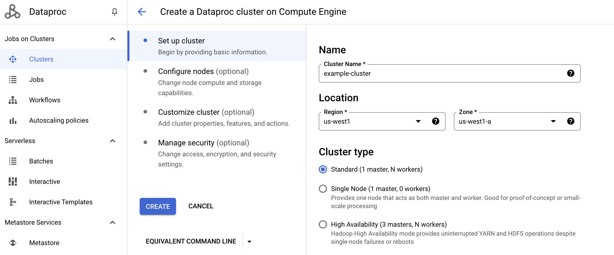
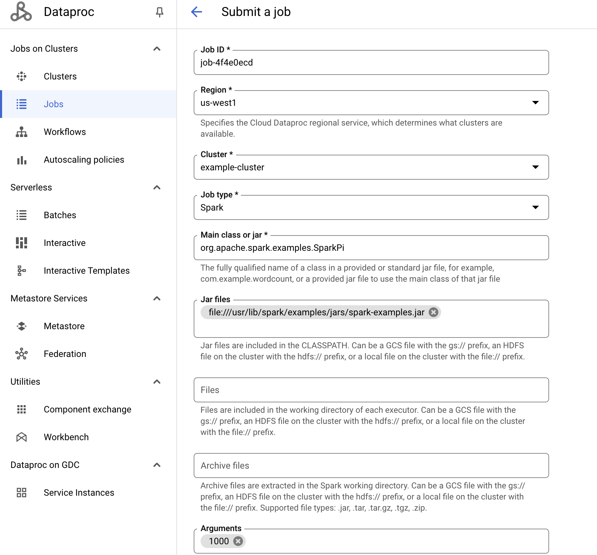

= Dataproc Console 
:toc: manual

== About Dataproc

Dataproc is a fast, easy-to-use, fully-managed cloud service for running Apache Spark and Apache Hadoop clusters in a simpler, more cost-efficient way. Operations that used to take hours or days take seconds or minutes instead.

Operations that used to take hours or days take seconds or minutes instead. Create Dataproc clusters quickly and resize them at any time, so you don't have to worry about your data pipelines outgrowing your clusters.

== Create Cluster

== Submit Spark Job

[source,bash]
----
stream_read_bytes_backwards_on_seek=0, gs_filesystem_create=3, exception_count=0, gcs_exception_count=0, gcs_api_total_request_count=33, op_create=1, stream_read_vectored_operations=0, gcs_metadata_request=17, gcs_api_client_bad_request_count=0, action_http_put_request=3, op_create_non_recursive=0, gcs_api_client_gone_response_count=0, gs_filesystem_initialize=2, stream_read_vectored_incoming_ranges=0, stream_write_operations=0, gcs_list_dir_request=0, stream_read_operations=0, gcs_api_client_request_timeout_count=0, op_rename=0, op_get_file_status=1, op_glob_status=0, op_exists=0, stream_write_bytes=3223144, op_xattr_list=0, op_get_delegation_token=0, gcs_api_server_unavailable_count=0, directories_created=1, files_delete_rejected=0, stream_read_vectored_combined_ranges=0, op_xattr_get_named=0, gcs_list_file_request=2, op_hsync=0, action_http_get_request=0, stream_read_operations_incomplete=0, op_delete=0, stream_read_bytes=0, gcs_api_client_non_found_response_count=15, op_list_located_status=0, gcs_api_client_requested_range_not_statisfiable_count=0, op_hflush=17, op_list_status=0, stream_read_vectored_read_bytes_discarded=0, op_xattr_get_named_map=0, gcs_api_client_side_error_count=16, op_get_file_checksum=0, gcs_api_server_internal_error_count=0, stream_read_seek_bytes_skipped=0, stream_write_close_operations=0, gcs_get_media_request=0, gcs_connector_time=3361, files_deleted=0, action_http_post_request=7, op_mkdirs=1, gcs_api_client_rate_limit_error_count=0, op_copy_from_local_file=0, gcs_api_server_bad_gateway_count=0, stream_readVectored_range_duration=0, stream_read_seek_backward_operations=0, gcs_api_server_side_error_count=0, stream_read_seek_operations=0, gcs_get_other_request=2, stream_read_seek_forward_operations=0, gcs_api_client_precondition_failed_response_count=1, op_xattr_get_map=0, delegation_tokens_issued=0, gcs_backoff_time=0, gcs_list_dir_request_min=0, gcs_metadata_request_min=23, op_delete_min=0, op_glob_status_min=0, op_create_non_recursive_min=0, op_hsync_min=0, op_xattr_get_named_min=0, op_xattr_get_named_map_min=0, op_hflush_min=0, op_xattr_list_min=0, action_http_put_request_min=82, op_open_min=0, gcs_list_file_request_min=21, stream_write_close_operations_min=0, op_create_min=377, action_http_delete_request_min=44, op_mkdirs_min=369, op_list_status_min=0, gcs_get_media_request_min=0, stream_readVectored_range_duration_min=0, stream_read_vectored_operations_min=0, stream_read_close_operations_min=0, stream_read_operations_min=0, stream_read_seek_operations_min=0, op_xattr_get_map_min=0, stream_write_operations_min=0, action_http_patch_request_min=0, op_get_file_status_min=1241, op_rename_min=0, delegation_tokens_issued_min=0, action_http_post_request_min=31, stream_read_close_operations_max=0, stream_read_seek_operations_max=0, op_hflush_max=706, op_xattr_list_max=0, op_xattr_get_map_max=0, action_http_put_request_max=254, action_http_patch_request_max=0, action_http_post_request_max=141, stream_write_close_operations_max=0, action_http_delete_request_max=44, op_mkdirs_max=369, gcs_get_media_request_max=0, op_rename_max=0, stream_read_vectored_operations_max=0, stream_readVectored_range_duration_max=0, op_xattr_get_named_map_max=0, stream_write_operations_max=0, stream_read_operations_max=0, op_xattr_get_named_max=0, op_glob_status_max=0, op_create_non_recursive_max=0, op_get_file_status_max=1241, op_open_max=0, delegation_tokens_issued_max=0, gcs_list_file_request_max=577, gcs_metadata_request_max=573, op_create_max=377, op_delete_max=0, op_list_status_max=0, op_hsync_max=0, gcs_list_dir_request_max=0, op_open_mean=0, op_xattr_list_mean=0, op_rename_mean=0, op_xattr_get_map_mean=0, gcs_list_dir_request_mean=0, op_glob_status_mean=0, stream_read_seek_operations_mean=0, gcs_list_file_request_mean=299, stream_write_operations_mean=0, op_hflush_mean=80, gcs_metadata_request_mean=75, op_list_status_mean=0, stream_read_close_operations_mean=0, op_xattr_get_named_map_mean=0, stream_read_vectored_operations_mean=0, op_mkdirs_mean=369, action_http_post_request_mean=88, stream_write_close_operations_mean=0, action_http_put_request_mean=152, action_http_patch_request_mean=0, op_hsync_mean=0, delegation_tokens_issued_mean=0, action_http_delete_request_mean=44, stream_read_operations_mean=0, op_create_mean=377, op_delete_mean=0, op_create_non_recursive_mean=0, stream_readVectored_range_duration_mean=0, op_xattr_get_named_mean=0, gcs_get_media_request_mean=0, op_get_file_status_mean=1241, op_delete_duration=0, op_get_file_status_duration=1241, action_http_put_request_duration=458, stream_write_operations_duration=0, op_hsync_duration=0, gcs_metadata_request_duration=1284, gcs_get_media_request_duration=0, gcs_list_file_request_duration=598, op_list_status_duration=0, op_mkdirs_duration=369, op_open_duration=0, op_create_duration=377, op_hflush_duration=1374, gcs_list_dir_request_duration=0, op_glob_status_duration=0, stream_read_operations_duration=0, action_http_delete_request_duration=88, action_http_post_request_duration=618, op_rename_duration=0
----

