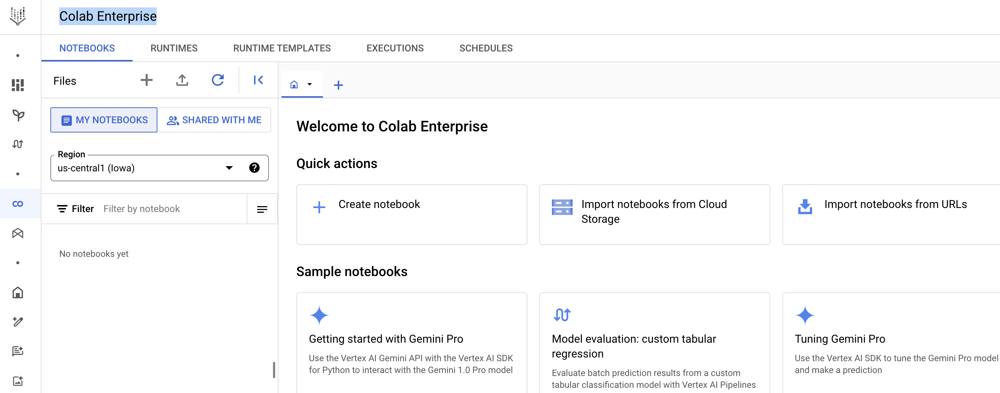

= Exploratory Data Analysis using Bigquery and Colab Enterprise 
:toc: manual

== Background

* Vertex AI is a unified platform for building, deploying, and managing machine learning (ML) applications.
* Vertex AI Colab Enterprise is a powerful collaborative interactive tool created to explore, analyze, transform and visualize data and build machine learning models on Google Cloud. It offers the security and compliance features needed for enterprise organizations and integrates with other Google Cloud services like Vertex AI and BigQuery for an enhanced data science and machine learning workflow.
* BigQuery is a powerful, fully managed, serverless data warehouse that allows you to analyze and manage large datasets with ease. BigQuery uses a familiar standard SQL dialect, making it easy for analysts and data scientists to use without needing to learn a new language.
* Vertex AI offers two Notebook Solutions, Workbench and Colab Enterprise.

== Create Colab Enterprise

