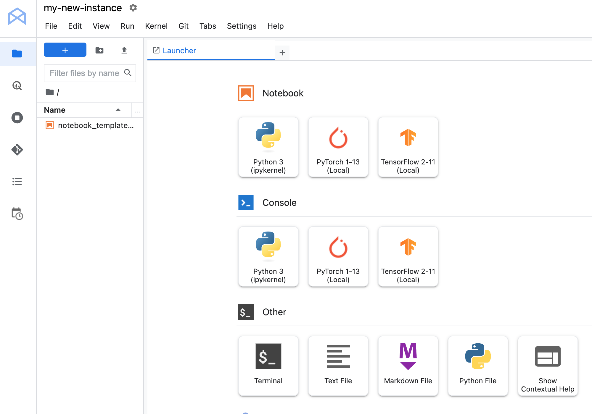

= Exploratory Data Analysis using Bigquery and Workbench Instances 
:toc: manual

== About Vertex AI Workbench

Vertex AI Workbench notebooks provide a flexible and scalable solution for developing and deploying ML models on Google Cloud. Choose Workbench if you need more customization options and need complete control over your machine learning environment. It offers the security and compliance features needed for enterprise organizations and integrates with other Google Cloud services like Vertex AI and BigQuery for an enhanced data science and machine learning workflow.

== About BigQuery

BigQuery is a powerful, fully managed, serverless data warehouse that allows you to analyze and manage large datasets with ease. BigQuery uses a familiar standard SQL dialect, making it easy for analysts and data scientists to use without needing to learn a new language.

== Workbench

