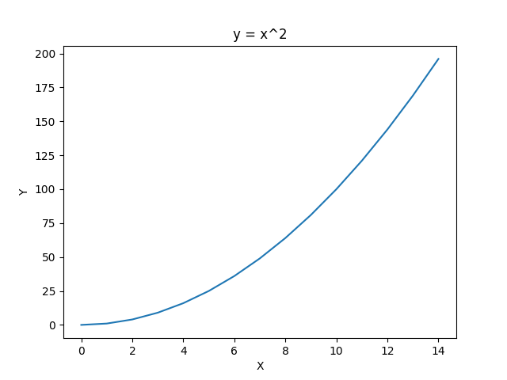
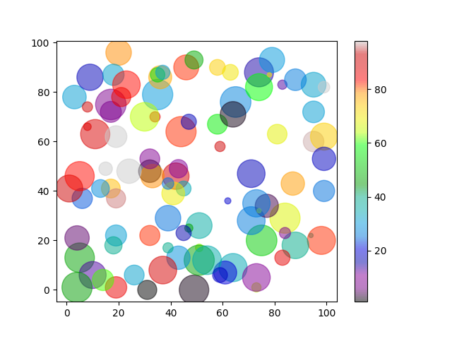

= Matplotlib Pyplot 
:toc: manual

== Linear

=== y = 2x + 10

[source, python]
----
x = tf.constant(range(15), dtype=tf.float32)
y = 2 * x + 10

x = [0, 1, 2, 3, 4, 5, 6 ,7 ,8, 9, 10, 11, 12, 13 ,14]
y = [10, 12, 14, 16, 18, 20, 22, 24, 26, 28, 30, 32, 34, 36, 38]

plt.plot(x, y, color='green', linestyle='dashed', marker='o')

plt.title('Linear: y = 2x + 10')
plt.xlabel('X')
plt.ylabel('Y')
plt.grid(True)

plt.show()
----

=== y = x^2

[source, python]
----
x = [0, 1, 2, 3, 4, 5, 6, 7, 8, 9, 10, 11, 12, 13 ,14]
y = [0, 1, 4, 9, 16, 25, 36, 49, 64, 81, 100, 121, 144, 169, 196]

plt.plot(x, y)

plt.title('y = x^2')
plt.xlabel('X')
plt.ylabel('Y')

plt.show()
----

=== ellipse

[source, python]
----
fig, ax = plt.subplots()

ellipse = Ellipse(xy=(0.5, 0.5), width=0.6, height=0.4, angle=30, edgecolor='b', facecolor='none')

ax.add_patch(ellipse)

ax.set_xlim(0, 1)
ax.set_ylim(0, 1)

ax.grid(True)

ax.set_title('Ellipse Example')
ax.set_xlabel('X-axis')
ax.set_ylabel('Y-axis')

plt.show()
----

== Scatter

[source, python]
----
x = np.array([5,7,8,7,2,17,2,9,4,11,12,9,6])
y = np.array([99,86,87,88,111,86,103,87,94,78,77,85,86])

plt.scatter(x, y)
plt.show()
----

[source, python]
----
x = np.array([5,7,8,7,2,17,2,9,4,11,12,9,6])
y = np.array([99,86,87,88,111,86,103,87,94,78,77,85,86])
plt.scatter(x, y)

x = np.array([2,2,8,1,15,8,12,9,7,3,11,4,7,14,12])
y = np.array([100,105,84,105,90,99,90,95,94,100,79,112,91,80,85])
plt.scatter(x, y)

plt.show()
----

[source, python]
----
x = np.array([5,7,8,7,2,17,2,9,4,11,12,9,6])
y = np.array([99,86,87,88,111,86,103,87,94,78,77,85,86])
colors = np.array([0, 10, 20, 30, 40, 45, 50, 55, 60, 70, 80, 90, 100])

plt.scatter(x, y, c=colors, cmap='viridis')
plt.colorbar()
plt.show()
----

[source, python]
----
x = np.random.randint(100, size=(100))
y = np.random.randint(100, size=(100))
colors = np.random.randint(100, size=(100))
sizes = 10 * np.random.randint(100, size=(100))

plt.scatter(x, y, c=colors, s=sizes, alpha=0.5, cmap='nipy_spectral')
plt.colorbar()
plt.show()
----

== Bar

=== Simple Bar

[source, python]
----
categories = ['A', 'B', 'C', 'D']
values = [4, 7, 1, 8]

plt.bar(categories, values)

plt.title('Simple Bar Plot')
plt.xlabel('Categories')
plt.ylabel('Values')

plt.show()
----

=== Group Bar

[source, python]
----
labels = ['Group 1', 'Group 2', 'Group 3', 'Group 4']
group1 = [20, 34, 30, 35]
group2 = [25, 32, 34, 20]
group3 = [30, 25, 24, 32]

x = np.arange(len(labels))  # the label locations
width = 0.2  # the width of the bars

fig, ax = plt.subplots()
rects1 = ax.bar(x - width, group1, width, label='Group 1')
rects2 = ax.bar(x, group2, width, label='Group 2')
rects3 = ax.bar(x + width, group3, width, label='Group 3')

ax.set_xlabel('Groups')
ax.set_ylabel('Scores')
ax.set_title('Scores by group and category')
ax.set_xticks(x)
ax.set_xticklabels(labels)
ax.legend()

def add_labels(rects):
    for rect in rects:
        height = rect.get_height()
        ax.annotate('{}'.format(height),
                    xy=(rect.get_x() + rect.get_width() / 2, height),
                    xytext=(0, 3),  # 3 points vertical offset
                    textcoords="offset points",
                    ha='center', va='bottom')

add_labels(rects1)
add_labels(rects2)
add_labels(rects3)

plt.show()
----

== Histogram

[source, python]
----
data = [1, 2, 2, 3, 3, 3, 4, 4, 4, 4, 5, 5, 5, 5, 5]

plt.hist(data, bins=5)

plt.title('Simple Histogram')
plt.xlabel('Value')
plt.ylabel('Frequency')

plt.show()
----

== Pie

[source, python]
----
y = np.array([35, 25, 25, 15])

plt.pie(y)
plt.show()
----

[source, python]
----
y = np.array([35, 25, 25, 15])
mylabels = ["Apples", "Bananas", "Cherries", "Dates"]

plt.pie(y, labels = mylabels)
plt.show()
----

[source, python]
----
y = np.array([35, 25, 25, 15])
mylabels = ["Apples", "Bananas", "Cherries", "Dates"]
myexplode = [0.2, 0, 0, 0]

plt.pie(y, labels = mylabels, explode = myexplode, shadow = True)
plt.show()
----

[source, python]
----
y = np.array([35, 25, 25, 15])
mylabels = ["Apples", "Bananas", "Cherries", "Dates"]

plt.pie(y, labels = mylabels)
plt.legend()
plt.show()
----

== Subplot

image:img/subplot.png[Image,638,479]

[source, python]
----
#plot 1:
x = np.array([0, 1, 2, 3])
y = np.array([3, 8, 1, 10])

plt.subplot(1, 2, 1)
plt.plot(x,y)

#plot 2:
x = np.array([0, 1, 2, 3])
y = np.array([10, 20, 30, 40])

plt.subplot(1, 2, 2)
plt.plot(x,y)

plt.show()
----
