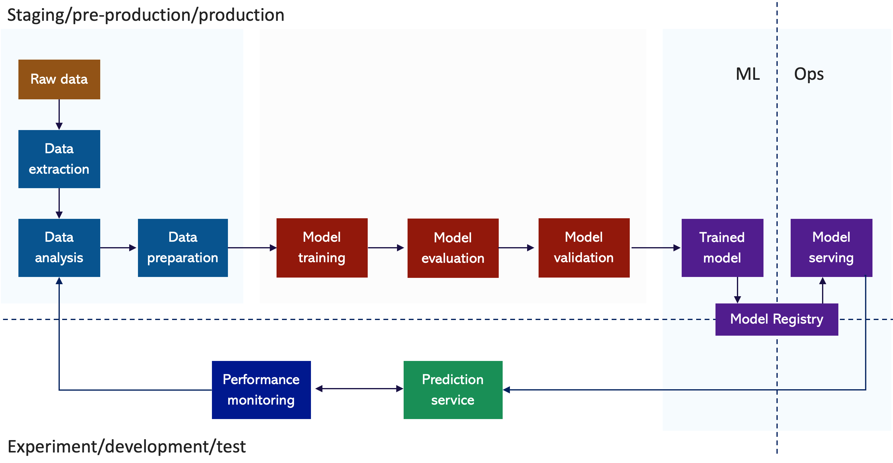

= Machine Learning
:toc: manual

== ML Pipeline

* *Data extraction* - retrieve data from various sources, those sources can be streaming in real time or batch.
* *Data analysis* - analyze the data you've extracted, eg, use Exploratory Data Analysis, or EDA, which involves using graphics and basic sample statistics to get a feeling for what information might be obtainable from your dataset.
* *Data preparation* - Data preparation includes data transformation, which is the process of changing or converting the format, structure, or values of data you've extracted into another format or structure. 

