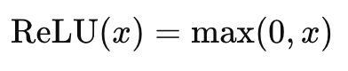
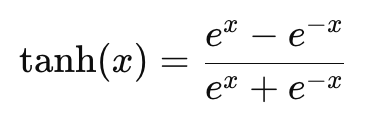
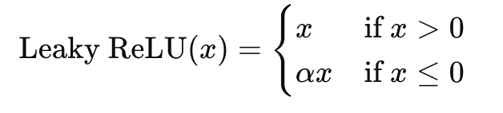
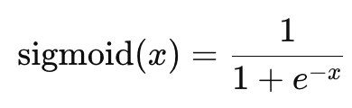
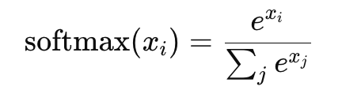

= Activation
:toc: manual

== Activation Function

.*Frequent Used Activation Function*
[cols="2,5a"]
|===
|Name |Notes

|ReLU
|

[source, python]
.*link:relu.py[relu.py]*
----
def relu(x):
    return max(0, x)
----

[source, bash]
.*Test*
----
% python3 relu.py
ReLU input:  [-5.0, 0.0, 5.0]
ReLU output: [0, 0, 5]
----

|Tanh
|

[source, python]
.*link:tanh.py[tanh.py]*
----
def tanh(x):
    return (math.exp(x) - math.exp(-x)) / (math.exp(x) + math.exp(-x))
----

[source, bash]
.*Test*
----
% python3 tanh.py 
Tanh input:  [-5.0, 0.0, 5.0]
Tanh output: [-0.999909204262595, 0.0, 0.999909204262595]
----

|Leaky ReLU
|

[source, python]
.*link:leaky_relu.py[leaky_relu.py]*
----
def leaky_relu(x):
    return max(0.01*x, x)
----

[source, bash]
.*Test*
----
% python3 leaky_relu.py
Leaky ReLU input:  [-5.0, 0.0, 5.0]
Leaky ReLU output: [-0.05, 0.0, 5]
----

|sigmoid
|S 型函数（sigmoid function）是一种常见的激活函数，在神经网络中被广泛使用。它的表达式为：

其中，`x` 是输入值，`S(x)` 是输出值。

S 型函数的图形是一个 S 型曲线，它具有以下特点：

* 当 x 趋近于负无穷时，S(x) 趋近于0；当 x 趋近于正无穷时，S(x) 趋近于1。
* S(x) 在0点处可求导, 导数S'(0)=1/4
* S(x) 是一个单调递增函数

[source, python]
.*link:sigmoid.py[sigmoid.p]*
----
def sigmoid(x):
    return 1 / (1 + math.exp(-x))
----

[source, bash]
.*Test*
----
% python3 sigmoid.py
Sigmoid input:  [-5.0, 0.0, 5.0]
Sigmoid output: [0.0066928509242848554, 0.5, 0.9933071490757153]
----

|Softmax
|

[source, python]
.*link:softmax.py[softmax.py]*
----
def softmax(x):
    e_x = [math.exp(i) for i in x]
    sum_e_x = sum(e_x)
    return [i / sum_e_x for i in e_x]
----

[source, bash]
.*Test*
----
% python3 softmax.py
Softmax input:  [-5.0, 0.0, 5.0]
Softmax Output: [4.509404123635488e-05, 0.006692549116589287, 0.9932623568421743]
----

|===

