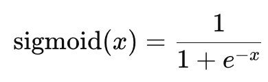

= Math
:toc: manual

== sigmoid function

S 型函数（sigmoid function）是一种常见的激活函数，在神经网络中被广泛使用。它的表达式为：

其中，`x` 是输入值，`S(x)` 是输出值。

S 型函数的图形是一个 S 型曲线，它具有以下特点：

* 当趋近于负无穷时，趋近于0；当趋近于正无穷时，趋近于1。
* S(x)在0点处可求导, 导数S'(0)=1/4
* S(x)是一个单调递增函数

[source, bash]
----
% python3 sigmoid.py
0.0066928509242848554
0.5
0.9933071490757153
----
